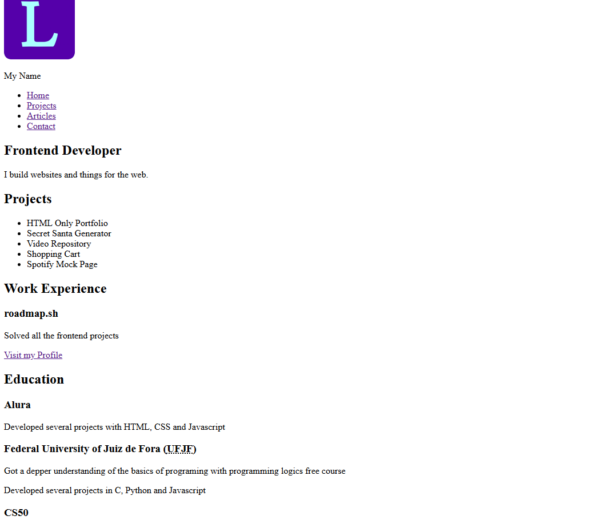

  <h1 align="center">
    Personal Portfolio
  </h1>

 

# Objective
Using the HTML only website from the previous project, adding a complete style and responsive layout.
  

# README
https://roadmap.sh/projects/portfolio-website
 
 

# PREVIEW

# EXTRA REQUIREMENTS
Use Google Fonts to enhance the typography of your website.

Look into GitHub Pages or Cloudflare Pages to host your website for free.

Add support for dark mode using CSS variables.
 
 

# Auxiliary Resources
<ol>
  <li>
    <a href="https://fonts.google.com/">https://fonts.google.com/</a>
     
    used for dark/light mode/menu icons and text font.
  </li>
   
  <li>
    <a href="https://css-tricks.com/snippets/css/a-guide-to-flexbox/" alt="CSS Flexbox Layout Guide">CSS Flexbox Layout Guide</a>
  </li>
   
  <li>
    <a href="https://www.youtube.com/watch?v=_gKEUYarehE" alt="youtube - Create a Dark Mode Switch with HTML, CSS, JavaScript">youtube - Create a Dark Mode Switch with HTML, CSS, JavaScript</a>
     
    some ideas on how to create a dark mode switch.
  </li>
   
  <li>
    <a href="https://www.w3schools.com/howto/howto_css_dropdown.asp" alt="How TO - Hoverable Dropdown">W3schools - How TO - Hoverable Dropdown/</a>
     
    structure for the menu used in mobile media queries.
  </li>
</ol>
