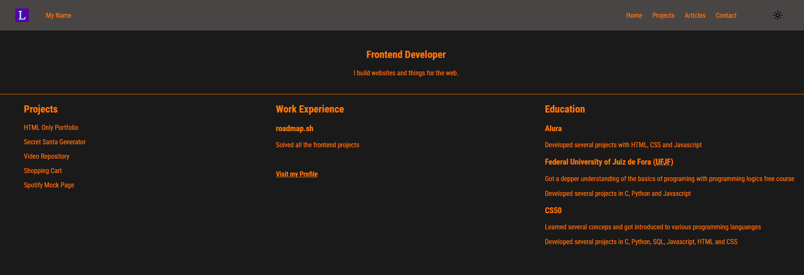

  <h1 align="center">
    HTML only website
  </h1>

 

# Objective 
HTML only website with multiple pages for the HTML beginner project on Frontend Dev roadmap, at roadmap.sh.
  

# README
https://roadmap.sh/projects/basic-html-website
 
 

# PREVIEW

# Auxiliary Resources
<ol>
  <li>
    <a href="https://favicon.io/" alt="favicon.io">hhttps://favicon.io/</a>
  </li>
  <li>
    <a href="https://youtu.be/kUMe1FH4CHE?si=IeZg9_DhK61DMclv&t=9643" alt="Learn HTML – Full Tutorial for Beginners_Ch.9">Learn HTML – Full Tutorial for Beginners -- chapter 9: Forms & Inputs</a>
  </li>
</ol>
